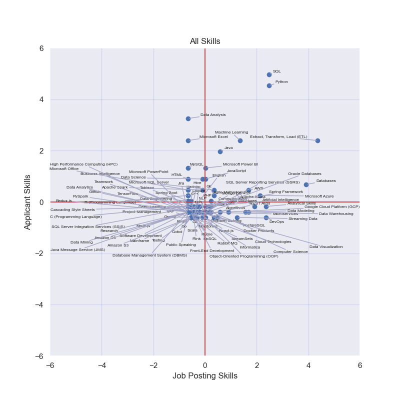
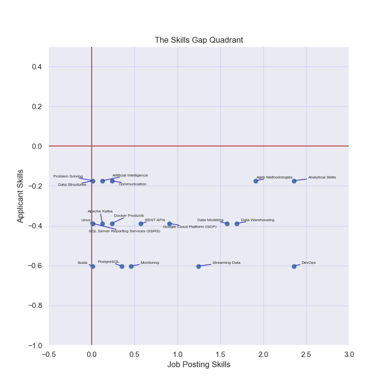
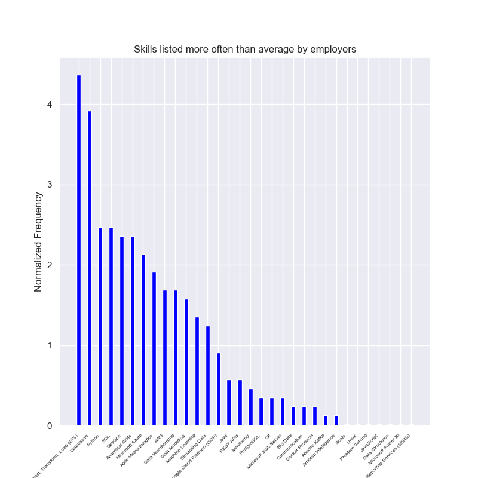
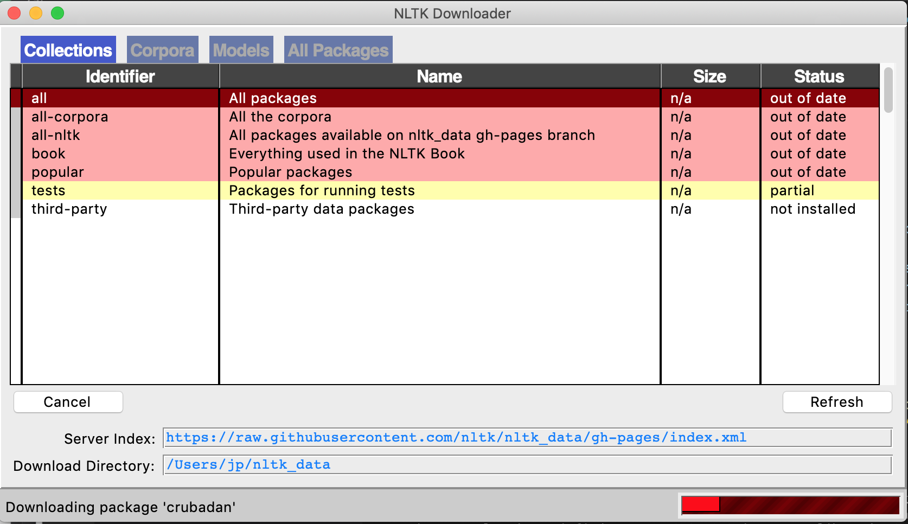
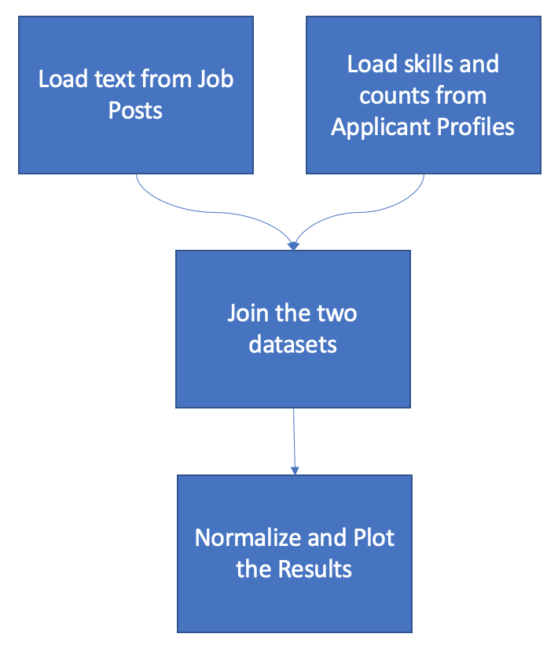

# Data Science Skills Gap Analysis

This project explores Data Science job postings and the skills that applicants list to find the "Skills Gap" (i.e., skills employers want, but applicants aren't providing).

### How does it work?
We take two sets of data (1) job postings text and (2) applicants skills.  Then, do a frequency count on skills terms.  Then, join them together and normalize the scores so we can plot them via a scatter plot, like:

X-Axis = Normalized frequency with which skills are mentioned in job postings
Y-Axis = Normalized frequency with which skills are mentioned in applicant profiles.

Thus:
Skills that lie to the right of zero on the x-axis are skills that are more frequently (than average) listed in job postings.

Skills that lie above zero on the y-axis are skills that are more frequently (than average) listed in applicant's profiles.

This is fairly cluttered, so we can zoom in on interesting portions of the graph like the lower right quadrant (below).  These points represent a "Skills Gap" formed when we limit our graph to just show the points above zero on the x-axis and below zero on the y-axis.  We see skills that employers demand (or, at least, mention in their job posts more often than average) and the skills that applicants are less able (than average) to provide (a quantified skills gap).

Also, if we ignore the y-axis and order skills strictly according to their x-axis position then sort descending, we get a list of the most in-demand skills according to employers.  Like this:

### See the numerical data too
The program exports both the the generated charts (into the /output/exported_charts directory) and the scored skills lists (into the /output/exported_data directory).

### Running the script
The data that I used to generate the charts for this README file and the associated blog post were from a selection of 34 LinkedIn Data Science job postings and the profiles of the applicants (available via LinkedIn Premium).  This data does not belong to me, so I can't republish it in this GitHub repostitory.  However, you can gather your own data (see the [Replicating the Study](#Replicating the Study) section below).

1. Clone the project into a directory on your machine.
2. Change into the project's directory.
3. Create and activate a virtual environment in which to run the project
`
python -m venv ./venv;
source ./venv/bin/activate;
`
4. Install the necessary libraries
`
pip install matplotlib numpy pandas nltk adjustText seaborn;
`
After it completes, you should see something like the following message:
`
Successfully installed adjustText-0.8 click-8.1.3 cycler-0.11.0 fonttools-4.38.0 importlib-metadata-6.0.0 joblib-1.2.0 kiwisolver-1.4.4 matplotlib-3.5.3 nltk-3.8.1 numpy-1.21.6 packaging-23.0 pandas-1.3.5 pillow-9.4.0 pyparsing-3.0.9 python-dateutil-2.8.2 pytz-2022.7.1 regex-2022.10.31 six-1.16.0 tqdm-4.64.1 typing-extensions-4.5.0 zipp-3.15.0
`
5. Copy-and-paste job postings text into new text files in the /data/job_postings_data directory.
6. Open a Terminal window in the project root directory and run:
`
cd src;
python SkillsAnalysis.py;
`
7. When you're done, you can close the virtual environment with:
`source deactivate`

Note: On the first run, you will be prompted to download the NLTK stopwords corpus with a prompt like the one below.  I downloaded everything, but you can select only the stopwords.

### Processing steps
It will run through the following processing steps:

### Replicating the Study
If you want to replicate the results of this work, you can simply:

1. Sign into LinkedIn and search for "Data Science" job postings
2. Copy the text from each posting into its own file in /data/job_postings
3. Using LinkedIn Premium subscription (probably available with a one-month free trial), record the number of times applicants list each skill in a CSV file like the one at /data/applicants/skills_and_counts.csv (you can just wipe out the existing counts and record your own)
4. Run the SkillsAnalysis.py script

### Extending the Study
If you want to extend this work to other job postings and skills in other fields, then you'll also need to modify:

1. Update the list of tokens (mine are heavily biased toward data science skills).  They are listed in a dictionary object defined in src/ObjListOfTokens.py.  When the Job Postings are being processed, this is the list of words and phrases that are being searched for.
2. Update the mapping of tokens to Skills.  Several tokens might match up to the same skill.  For example, "Microsoft SQL Server" and "mssql" both refer to the same thing.  In this mapping file, we take each of the tokens found in Job Posting text and map it to its associated Skill.  This can all configured in the ObjTokensToSkills.py file.
3. Update the stop words.  Stop words are common words that we don't care about.  For example, "the", "I", "are", "using", "apply", and "etc.".  These words are stripped out of the Job Postings before they are analyzed.  NLTK provides a small list of common words which we include, but there is a data/stopwords/stop.txt file where you can add more words that you don't care about.

### Changing input and output file locations
The input and output files and directories are all configured in a dictionary object defined in the /config/config.py file.  By editting this file, you can:
1. The stopwords file location
2. The directory in which to find job postings text files for analysis
3. The file from which to pull applicants' skills and counts
4. The export filepaths for all CSV output datasets (all_skills, skills_gap_quadrant, etc.)
5. The export filepaths for all generated charts
